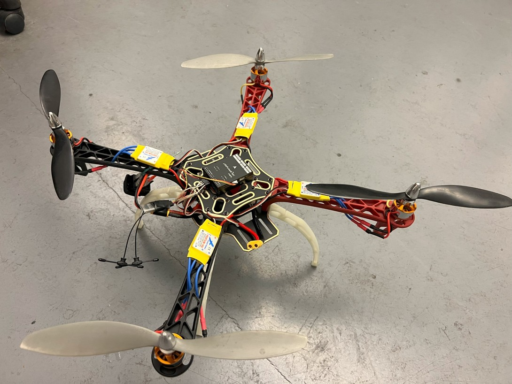

# MyDrone
Building a drone from scratch

## Hardware

### UART Connections
Red - VCC

Yellow - TX

White - RX

Black - GND

## Demonstration

## Pixhawk 6C Mini Ports
https://docs.holybro.com/autopilot/pixhawk-6c-mini/pixhawk-6c-mini-ports

### Serial Port Mapping
https://docs.px4.io/main/en/flight_controller/pixhawk6c_mini.html#serial-port-mapping